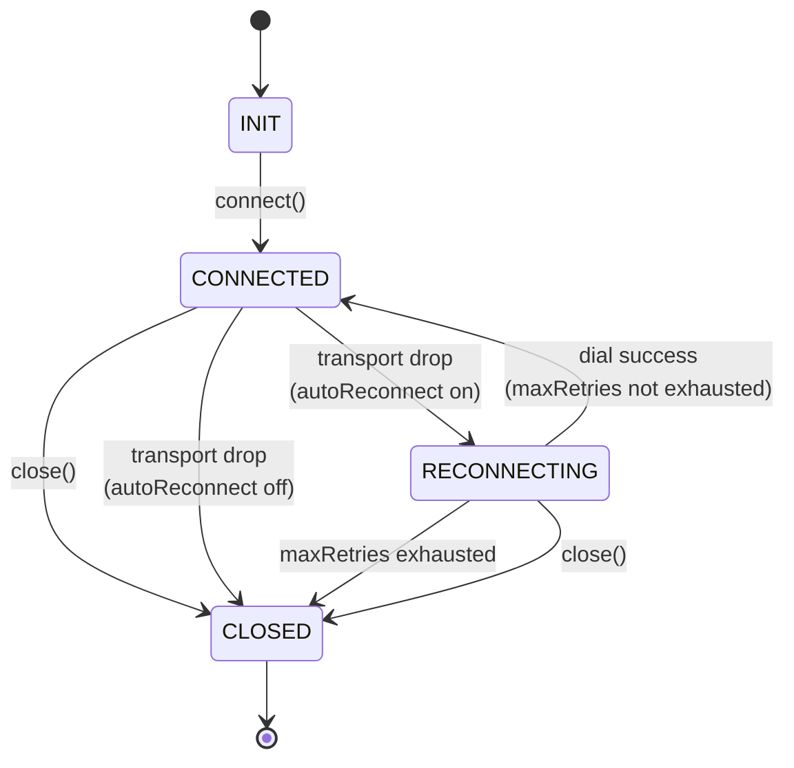

# wspulse Client Behaviour Contract

> Version: 0 (unstable — aligned with protocol v0)
> Applies to: all `wspulse/client-*` libraries

This document defines the **behavioural requirements** that every wspulse client must implement, regardless of language. API surface (types, method names) is in [`client-interface.md`](./client-interface.md).

---

## Connection Lifecycle

States are conceptual; implementations need not expose them as an enum.

---

## Callback Semantics

### `onMessage(frame)`

- Fires for every inbound frame decoded by the codec.
- Called synchronously in the read goroutine/task/coroutine — **do not block**.
- Must not fire after `onDisconnect` has been called.

### `onTransportDrop(err)`

- Fires each time the underlying WebSocket connection drops unexpectedly.
- Fires **before** any reconnect attempt.
- Fires even when auto-reconnect is enabled (once per drop, not once per retry).
- `err` is never nil/null — always carries the transport-level error.
- Does **not** fire when `close()` is called by the user.

### `onReconnect(attempt)`

- Fires at the start of each reconnect attempt (before the dial).
- `attempt` is 0-based: first retry = 0, second retry = 1, etc.
- Fires regardless of whether the attempt succeeds.

### `onDisconnect(err)`

- Fires **exactly once** per Client lifetime, when the client reaches `CLOSED`.
- `err` is `nil`/`null` for a clean close (user called `close()`).
- `err` is `RetriesExhaustedError` when max retries are exhausted.
- `err` is `ConnectionLostError` when the server drops and auto-reconnect is off.
- Must be the **last** callback to fire — no `onMessage` or `onTransportDrop` after this.

---

## Auto-Reconnect Behaviour

When `autoReconnect` is enabled:

1. On transport drop → fire `onTransportDrop(err)`.
2. Wait `delay = min(baseDelay × 2^attempt, maxDelay) × jitter(0.8..1.2)`.
3. Fire `onReconnect(attempt)`.
4. Attempt to dial.
5. If successful → go to `CONNECTED`; pendng send-queue is preserved.
6. If failed → increment `attempt`; if `attempt >= maxRetries > 0` → go to step 7; else go to step 2.
7. Fire `onDisconnect(RetriesExhaustedError)` → `CLOSED`.

When `autoReconnect` is disabled:

1. On transport drop → fire `onTransportDrop(err)`.
2. Fire `onDisconnect(ConnectionLostError)` → `CLOSED`.

---

## `close()` Semantics

- May be called from any goroutine/thread/coroutine.
- Idempotent: calling `close()` more than once is safe and has no effect after the first call.
- If called while `CONNECTED`: cancel any pending write, close the WebSocket, fire `onDisconnect(nil)`.
- If called while `RECONNECTING`: stop the reconnect loop immediately, fire `onDisconnect(nil)`.
- After `close()` returns (or the returned Promise/coroutine resolves), all internal goroutines/tasks must have exited.

---

## `send()` Semantics

- Enqueues the encoded frame into a bounded internal buffer.
- Returns/resolves immediately (non-blocking).
- Raises `ConnectionClosedError` if the client is in `CLOSED` state.
- If the buffer is full: the **oldest** frame is dropped (head-drop). This matches server backpressure behaviour.
- Frames are delivered in enqueue order. No reordering.

---

## Heartbeat

The wspulse server sends WebSocket **Ping** frames every `pingPeriod` (default 10 s). Clients must respond with a **Pong**.

- Standard WebSocket libraries handle Pong automatically — do not implement manually unless the library requires it.
- If the server receives no Pong within `pongWait` (default 30 s), it closes the connection. The client will see a transport drop and (if auto-reconnect is on) reconnect.
- Client-side `heartbeat` options (`pingPeriod`, `pongWait`) configure the client's _expectation_ of server timing, not a client-initiated Ping.

---

## Concurrency Requirements

| Requirement           | Detail                                                                               |
| --------------------- | ------------------------------------------------------------------------------------ |
| Thread-safe `send()`  | Multiple callers may call `send()` concurrently without data races.                  |
| Thread-safe `close()` | May be called concurrently with `send()` or other operations.                        |
| Callback isolation    | Callbacks must not hold internal locks; deadlocks from re-entrant calls are a bug.   |
| `onDisconnect` once   | Exactly one `onDisconnect` call, even under concurrent close + transport-drop races. |

---

## Shared Test Scenarios

Every client lib must pass these behavioural tests against a live `wspulse/server`:

| #   | Scenario                                                                              | Pass condition                                                 |
| --- | ------------------------------------------------------------------------------------- | -------------------------------------------------------------- |
| 1   | Connect, send frame, receive echo, `close()` cleanly                                  | `onDisconnect(nil)` fires; `done` resolves                     |
| 2   | Server drops connection (auto-reconnect off)                                          | `onTransportDrop` → `onDisconnect(ConnectionLostError)`        |
| 3   | Server drops; client reconnects within maxRetries                                     | `onTransportDrop` → `onReconnect(0)` → `onMessage` works again |
| 4   | Server drops repeatedly; max retries exhausted                                        | `onDisconnect(RetriesExhaustedError)` fires exactly once       |
| 5   | `close()` called during reconnect loop                                                | Loop stops; `onDisconnect(nil)` fires; no further callbacks    |
| 6   | `send()` after `close()`                                                              | Raises / returns `ConnectionClosedError`                       |
| 7   | Heartbeat: server closes after no Pong (simulated)                                    | Client reconnects (if auto-reconnect on)                       |
| 8   | Concurrent `send()` from multiple threads/goroutines/tasks                            | No data race; all frames delivered in order per sender         |
| 9   | `onDisconnect` + transport drop race (close() called simultaneously with server drop) | `onDisconnect` fires exactly once                              |
