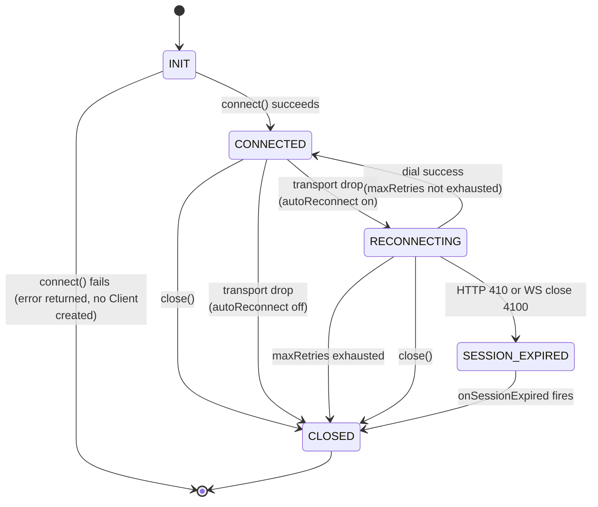

# wspulse Client Behaviour Contract

> Version: 0 (unstable — aligned with protocol v0)
> Applies to: all `wspulse/client-*` libraries

This document defines the **behavioural requirements** that every wspulse client must implement, regardless of language. API surface (types, method names) is in [`interface.md`](./interface.md).

---

## Connection Lifecycle

States are conceptual; implementations need not expose them as an enum.

Note: `INIT → [*]` (connect failure) is a terminal path — the client object is
never created, no callbacks fire, and `autoReconnect` has no effect.

Note: `SESSION_EXPIRED` is a transient state — the client transitions to
`CLOSED` immediately after `onSessionExpired` fires. The application layer
decides whether to create a new connection.

---

## Callback Semantics

### `onMessage(frame)`

- Fires for every inbound frame decoded by the codec.
- Called synchronously in the read goroutine/task/coroutine — **do not block**.
- Must not fire after `onDisconnect` has been called.

### `onTransportDrop(err)`

- Fires each time the underlying WebSocket connection drops unexpectedly.
- Fires **before** any reconnect attempt.
- Fires even when auto-reconnect is enabled (once per drop, not once per retry).
- `err` is never nil/null — always carries the transport-level error.
- Does **not** fire when `close()` is called by the user.

### `onTransportRestore()`

- Fires after a successful reconnect when the new transport is ready and pumps are running.
- Fires exactly once per successful reconnect (not on each retry attempt).
- Does **not** fire on the initial connection (only after a transport drop + successful reconnect).
- Must fire before any `onMessage` from the new transport.

### `onSessionExpired()`

- Fires when a reconnect attempt receives **HTTP 410 Gone** or **WS close code 4100** (`CloseSessionExpired`) from the server.
- Indicates the server session no longer exists: the resume window has expired or the server has restarted. Buffered messages from the previous session are lost.
- The auto-reconnect loop **stops immediately** — the SDK does not retry.
- Fires **before** `onDisconnect`.
- The application layer decides the next step: establish a new connection, show UI, or exit.

### `onDisconnect(err)`

- Fires **exactly once** per Client lifetime, when the client reaches `CLOSED`.
- `err` is `nil`/`null` for a clean close (user called `close()`).
- `err` is `RetriesExhaustedError` when max retries are exhausted.
- `err` is `ConnectionLostError` when the server drops and auto-reconnect is off.
- `err` is `SessionExpiredError` when the server session has expired (after `onSessionExpired` fires).
- Must be the **last** callback to fire — no `onMessage` or `onTransportDrop` after this.

---

## Initial Connection Failure

The initial `connect()` / `Dial()` call must succeed before any lifecycle begins.
If the initial dial fails, `connect()` returns/throws an error **regardless of
whether `autoReconnect` is enabled**. No callbacks fire (`onTransportDrop`,
`onTransportRestore`, `onDisconnect` are never called), and no `Client` object is
returned.

Auto-reconnect only activates after a successful initial connection — it handles
transient network failures during an established session, not configuration
errors at startup.

---

## Auto-Reconnect Behaviour

**Precondition:** the client has previously reached `CONNECTED` at least once.

When `autoReconnect` is enabled:

1. On transport drop → fire `onTransportDrop(err)`.
2. Wait `delay = min(baseDelay × 2^attempt, maxDelay) × jitter(0.5..1.0)` (equal jitter).
3. Attempt to dial with `?resume=true` appended to the URL (reconnect only, not the initial connection).
4. If HTTP 410 or WS close 4100 → go to step 7.
5. If successful → fire `onTransportRestore()` → go to `CONNECTED`; pending send-queue is preserved.
6. If failed → increment `attempt`; if `attempt >= maxRetries > 0` → go to step 8; else go to step 2.
7. Fire `onSessionExpired()` → fire `onDisconnect(SessionExpiredError)` → `CLOSED`. Stop.
8. Fire `onDisconnect(RetriesExhaustedError)` → `CLOSED`.

When `autoReconnect` is disabled:

1. On transport drop → fire `onTransportDrop(err)`.
2. Fire `onDisconnect(ConnectionLostError)` → `CLOSED`.

---

## `close()` Semantics

- May be called from any goroutine/thread/coroutine.
- Idempotent: calling `close()` more than once is safe and has no effect after the first call.
- If called while `CONNECTED`: cancel any pending write, close the WebSocket, fire `onDisconnect(nil)`.
- If called while `RECONNECTING`: stop the reconnect loop immediately, fire `onDisconnect(nil)`.
- After `close()` returns (or the returned Promise/coroutine resolves), all internal goroutines/tasks must have exited.

---

## `send()` Semantics

- Enqueues the encoded frame into a bounded internal buffer.
- Returns/resolves immediately (non-blocking).
- Raises `ConnectionClosedError` if the client is in `CLOSED` state.
- If the buffer is full: raises `SendBufferFullError`. The caller decides how to handle backpressure (retry, discard, or close). Note: server-side broadcast uses head-drop for 1:N fanout; client-side send is 1:1 and must not silently discard frames.
- Frames are delivered in enqueue order. No reordering.

---

## Heartbeat

wspulse uses a **dual heartbeat** model: both the server and the client independently send WebSocket **Ping** control frames and monitor **Pong** replies to detect dead connections.

### Server-side heartbeat

- The server sends Ping every `pingPeriod` (default **10 s**).
- If no Pong is received within `pongWait` (default **30 s**), the server closes the connection.
- Clients auto-reply Pong at the protocol layer (handled by gorilla/websocket, browser engines, and other standard WebSocket libraries).

### Client-side heartbeat

- Native clients (Go, Node.js) **also** send their own Ping every `pingPeriod` (default **20 s**).
- If no Pong is received within `pongWait` (default **60 s**), the client closes the socket, triggering a transport drop (and reconnect if enabled).
- The server auto-replies Pong at the protocol layer (gorilla default `PingHandler`).
- **Browser clients** cannot send Ping frames — the browser WebSocket API provides no programmatic access to Ping/Pong control frames. In browser environments the client-side heartbeat is a **no-op**; liveness detection relies entirely on the server-side heartbeat.

### Why dual heartbeat?

- **Independent fault detection** — each side detects the other's failure on its own schedule without a one-directional dependency.
- **Staggered defaults** — the server uses a tight interval (10 s / 30 s) for fast resource reclamation; clients use a lenient interval (20 s / 60 s) suited for mobile and spotty networks.
- **NAT keepalive** — client-initiated Ping keeps NAT/firewall state alive. Some corporate proxies only track client-originated traffic.

### Configurability

Both `pingPeriod` and `pongWait` are fully configurable on each side. Developers should adjust values to match their network environment and resource constraints. The constraint `pingPeriod < pongWait` must always hold.

---

## Concurrency Requirements

| Requirement           | Detail                                                                               |
| --------------------- | ------------------------------------------------------------------------------------ |
| Thread-safe `send()`  | Multiple callers may call `send()` concurrently without data races.                  |
| Thread-safe `close()` | May be called concurrently with `send()` or other operations.                        |
| Callback isolation    | Callbacks must not hold internal locks; deadlocks from re-entrant calls are a bug.   |
| `onDisconnect` once   | Exactly one `onDisconnect` call, even under concurrent close + transport-drop races. |

---

## Logging

Every client must log internal diagnostics using the ecosystem's standard logger:

| Language   | Logger                  |
| ---------- | ----------------------- |
| Go         | `go.uber.org/zap`       |
| Kotlin/JVM | SLF4J                   |
| TypeScript | `console`               |
| Swift      | `os.Logger`             |

Rules:

1. **Enabled by default** — the logger must produce output without any user configuration. Users may replace or disable it via options.
2. **Minimum log points** — the following events must be logged:
   - `warn`: decode failure (frame dropped), write failure, pong timeout, retries exhausted.
   - `info`: connected, reconnected, closing, transport dropped.
   - `debug`: reconnect attempt with delay.
3. **Message prefix** — all log messages must start with `wspulse/client:`.

---

## Shared Test Scenarios

Every client lib must pass these behavioural tests against a live `wspulse/server`:

| #   | Scenario                                                                              | Pass condition                                                 |
| --- | ------------------------------------------------------------------------------------- | -------------------------------------------------------------- |
| 1   | Connect, send frame, receive echo, `close()` cleanly                                  | `onDisconnect(nil)` fires; `done` resolves                     |
| 2   | Server drops connection (auto-reconnect off)                                          | `onTransportDrop` → `onDisconnect(ConnectionLostError)`        |
| 3   | Server drops; client reconnects within maxRetries                                     | `onTransportDrop` → `onReconnect(0)` → `onMessage` works again |
| 4   | Server drops repeatedly; max retries exhausted                                        | `onDisconnect(RetriesExhaustedError)` fires exactly once       |
| 5   | `close()` called during reconnect loop                                                | Loop stops; `onDisconnect(nil)` fires; no further callbacks    |
| 6   | `send()` after `close()`                                                              | Raises / returns `ConnectionClosedError`                       |
| 7   | Heartbeat: server closes after no Pong (simulated)                                    | Client reconnects (if auto-reconnect on)                       |
| 8   | Concurrent `send()` from multiple threads/goroutines/tasks                            | No data race; all frames delivered in order per sender         |
| 9   | `onDisconnect` + transport drop race (close() called simultaneously with server drop) | `onDisconnect` fires exactly once                              |
| 10  | Session expired: server drops; resume window expires; client reconnects with `?resume=true` | `onSessionExpired` fires; `onDisconnect(SessionExpiredError)` fires; auto-reconnect stops |
| 11  | Session expired: `onSessionExpired` fires, application creates a new connection | New `connect()` succeeds; new Client operates independently    |
