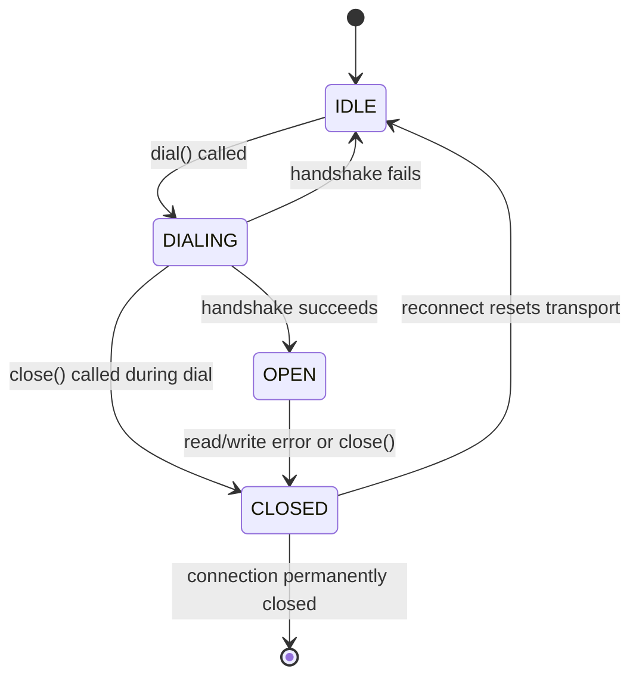
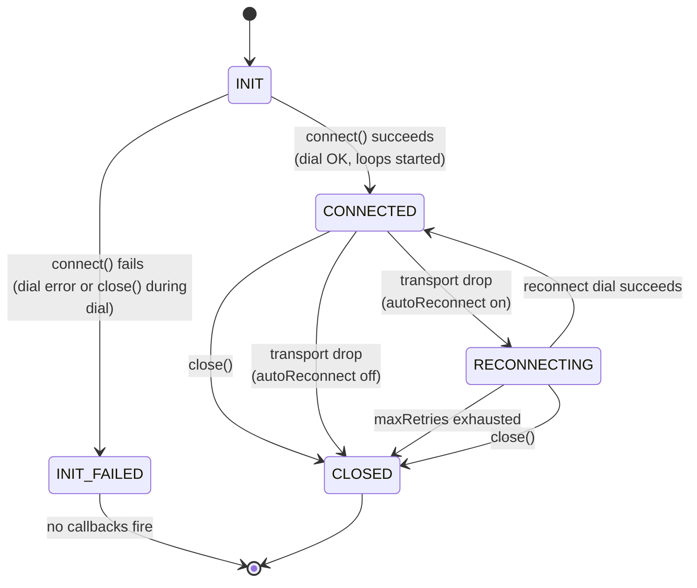

# wspulse Client Behaviour Contract

> Version: 0 (unstable — aligned with protocol v0)
> Applies to: all `wspulse/client-*` libraries

This document defines the **behavioural requirements** that every wspulse client must implement, regardless of language. API surface (types, method names) is in [`interface.md`](./interface.md).

---

## State Model Overview

wspulse client state is best understood as two distinct layers:

| Layer          | Scope                                                                                      |
| -------------- | ------------------------------------------------------------------------------------------ |
| **Connection** | The high-level lifecycle the user observes (INIT → CONNECTED → CLOSED). Governs callbacks. |
| **Transport**  | The low-level WebSocket socket state (IDLE → DIALING → OPEN → CLOSED). Invisible to users. |

The two layers are **not 1:1**. A single Connection lifecycle may span multiple
Transport open/close cycles (via reconnect). Understanding which layer a
callback belongs to prevents confusion about when callbacks fire.

---

## Transport Layer

The transport represents a single WebSocket socket. It is an internal
abstraction — users never interact with it directly.

Key points:

- **DIALING is a suspension point** — in async runtimes (Swift actors, Kotlin
  coroutines), `close()` may execute concurrently while `dial()` is in-flight.
- A transport that transitions DIALING → CLOSED (via concurrent `close()`)
  must never start read/write loops.
- Transport CLOSED → IDLE only happens during auto-reconnect; the
  Connection layer orchestrates when to retry.

---

## Connection Lifecycle

The connection layer is what the user sees. States are conceptual;
implementations need not expose them as an enum.

Note: `INIT_FAILED` is a terminal path — no Client/callbacks are produced.
This includes both dial errors **and** `close()` called during an in-flight
`connect()`. In the latter case, `connect()` throws `ConnectionClosedError`.

---

## Callback × State Transition Matrix

This matrix defines exactly which callbacks fire on each state transition.
"—" means the callback does not fire for that transition.

| Transition               | Trigger                           | `onTransportDrop`      | `onTransportRestore`   | `onDisconnect`                        |
| ------------------------ | --------------------------------- | ---------------------- | ---------------------- | ------------------------------------- |
| INIT → CONNECTED         | `connect()` succeeds              | —                      | —                      | —                                     |
| INIT → INIT_FAILED       | dial fails                        | —                      | —                      | —                                     |
| INIT → INIT_FAILED       | `close()` during dial             | —                      | —                      | —                                     |
| CONNECTED → RECONNECTING | transport error                   | `onTransportDrop(err)` | —                      | —                                     |
| CONNECTED → CLOSED       | `close()`                         | `onTransportDrop(nil)` | —                      | `onDisconnect(nil)`                   |
| CONNECTED → CLOSED       | transport drop, no auto-reconnect | `onTransportDrop(err)` | —                      | `onDisconnect(ConnectionLostError)`   |
| RECONNECTING → CONNECTED | reconnect succeeds                | —                      | `onTransportRestore()` | —                                     |
| RECONNECTING → CLOSED    | `close()`                         | —                      | —                      | `onDisconnect(nil)`                   |
| RECONNECTING → CLOSED    | maxRetries exhausted              | —                      | —                      | `onDisconnect(RetriesExhaustedError)` |

Rules that follow from the matrix:

1. **INIT → INIT_FAILED fires zero callbacks.** The client was never connected; there is nothing to "disconnect" from.
2. **CONNECTED → CLOSED via `close()` fires both** `onTransportDrop(nil)` and `onDisconnect(nil)`, in that order.
3. **RECONNECTING → CLOSED via `close()` fires only `onDisconnect(nil)`.** `onTransportDrop` already fired for the original transport drop — it does not fire again.
4. **`onDisconnect` fires exactly once** per client lifetime, always as the last callback.

---

## Callback Semantics

### `onMessage(frame)`

- Fires for every inbound frame decoded by the codec.
- Called synchronously in the read goroutine/task/coroutine — **do not block**.
- Must not fire after `onDisconnect` has been called.

### `onTransportDrop(err)`

- Fires each time an active transport closes — whether due to a server drop, network failure, or user-initiated `close()`.
- Fires **before** any reconnect attempt.
- Fires even when auto-reconnect is enabled (once per drop, not once per retry).
- `err` is `nil`/`null` when triggered by `close()` (user-initiated graceful shutdown).
- `err` is non-nil for unexpected drops — carries the transport-level error.
- Applications use `err == nil` to distinguish user-initiated closes from unexpected failures.
- When `close()` is called while `RECONNECTING` (no active transport), `onTransportDrop` does **not** fire again — it already fired for the original drop.

### `onTransportRestore()`

- Fires after a successful reconnect when the new transport is ready and pumps are running.
- Fires exactly once per successful reconnect (not on each retry attempt).
- Does **not** fire on the initial connection (only after a transport drop + successful reconnect).
- Must fire before any `onMessage` from the new transport.

### `onDisconnect(err)`

- Fires **exactly once** per Client lifetime, when the client reaches `CLOSED`.
- `err` is `nil`/`null` for a clean close (user called `close()`).
- `err` is `RetriesExhaustedError` when max retries are exhausted.
- `err` is `ConnectionLostError` when the server drops and auto-reconnect is off.
- Must be the **last** callback to fire — no `onMessage` after this.
- When triggered by `close()` while `CONNECTED`, `onTransportDrop(nil)` fires immediately before `onDisconnect(nil)`.

---

## Initial Connection Failure

The initial `connect()` / `Dial()` call must succeed before any lifecycle begins.
If the initial dial fails, `connect()` returns/throws an error **regardless of
whether `autoReconnect` is enabled**. No callbacks fire (`onTransportDrop`,
`onTransportRestore`, `onDisconnect` are never called), and no `Client` object is
returned (or, in two-phase SDKs like Swift, the Client exists but never reaches
CONNECTED).

This includes two sub-cases:

1. **Dial error** — network unreachable, handshake rejected, TLS failure, etc.
   `connect()` throws the underlying transport error.
2. **`close()` during dial** — another task/goroutine calls `close()` while
   `connect()` is awaiting the handshake. `connect()` throws
   `ConnectionClosedError`. See "Race: `close()` during `connect()`" under
   `close()` Semantics.

In both cases: zero callbacks fire, `done` resolves, and the client is
permanently closed.

Auto-reconnect only activates after a successful initial connection — it handles
transient network failures during an established session, not configuration
errors at startup.

---

## Auto-Reconnect Behaviour

**Precondition:** the client has previously reached `CONNECTED` at least once.

When `autoReconnect` is enabled:

1. On transport drop → fire `onTransportDrop(err)`.
2. Wait `delay = min(baseDelay × 2^attempt, maxDelay) × jitter(0.5..1.0)` (equal jitter).
3. Attempt to dial.
4. If successful → fire `onTransportRestore()` → go to `CONNECTED`; pending send-queue is preserved.
5. If failed → increment `attempt`; if `attempt >= maxRetries > 0` → go to step 6; else go to step 2.
6. Fire `onDisconnect(RetriesExhaustedError)` → `CLOSED`.

When `autoReconnect` is disabled:

1. On transport drop → fire `onTransportDrop(err)`.
2. Fire `onDisconnect(ConnectionLostError)` → `CLOSED`.

---

## `close()` Semantics

- May be called from any goroutine/thread/coroutine.
- Idempotent: calling `close()` more than once is safe and has no effect after the first call.
- If called while `CONNECTED`: cancel any pending write, close the WebSocket, fire `onTransportDrop(nil)` → `onDisconnect(nil)`.
- If called while `RECONNECTING`: stop the reconnect loop immediately, fire `onDisconnect(nil)`. (`onTransportDrop` already fired for the original drop — do **not** fire again.)
- If called while `INIT` (during an in-flight `connect()`): see "Race: `close()` during `connect()`" below.
- After `close()` returns (or the returned Promise/coroutine resolves), all internal goroutines/tasks must have exited.

### Race: `close()` during `connect()`

In async runtimes (Swift actors, Kotlin coroutines, JS async/await), `close()`
may execute while `connect()` is suspended on the initial `dial()`. This is the
INIT → INIT_FAILED path with `close()` as the trigger.

Required behaviour:

1. `close()` sets the closed flag and returns. **No callbacks fire** — the client
   has never been connected (`connected` / `hasConnected` is still false).
2. When `dial()` eventually resumes inside `connect()`:
   - `connect()` detects the closed flag.
   - If dial succeeded: close the transport immediately, do not start loops.
   - `connect()` throws `ConnectionClosedError`.
3. `done` resolves so callers awaiting permanent disconnection are unblocked.

**Implementation note:** A `connected` (or `hasConnected`) flag — set only
after the first successful dial and **never reset** — is the recommended way to
gate callbacks. Using `started` or any flag set before dial completes is
incorrect because `close()` would see it during the dial suspension and
erroneously fire callbacks.

---

## `send()` Semantics

- Enqueues the encoded frame into a bounded internal buffer.
- Returns/resolves immediately (non-blocking).
- Raises `ConnectionClosedError` if the client is in `CLOSED` state.
- If the buffer is full: raises `SendBufferFullError`. The caller decides how to handle backpressure (retry, discard, or close). Note: server-side broadcast uses head-drop for 1:N fanout; client-side send is 1:1 and must not silently discard frames.
- Frames are delivered in enqueue order. No reordering.

---

## Heartbeat

wspulse uses a **dual heartbeat** model: both the server and the client independently send WebSocket **Ping** control frames and monitor **Pong** replies to detect dead connections.

### Server-side heartbeat

- The server sends Ping every `pingPeriod` (default **10 s**).
- If no Pong is received within `pongWait` (default **30 s**), the server closes the connection.
- Clients auto-reply Pong at the protocol layer (handled by gorilla/websocket, browser engines, and other standard WebSocket libraries).

### Client-side heartbeat

- Native clients (Go, Node.js) **also** send their own Ping every `pingPeriod` (default **20 s**).
- If no Pong is received within `pongWait` (default **60 s**), the client closes the socket, triggering a transport drop (and reconnect if enabled).
- The server auto-replies Pong at the protocol layer (gorilla default `PingHandler`).
- **Browser clients** cannot send Ping frames — the browser WebSocket API provides no programmatic access to Ping/Pong control frames. In browser environments the client-side heartbeat is a **no-op**; liveness detection relies entirely on the server-side heartbeat.

### Why dual heartbeat?

- **Independent fault detection** — each side detects the other's failure on its own schedule without a one-directional dependency.
- **Staggered defaults** — the server uses a tight interval (10 s / 30 s) for fast resource reclamation; clients use a lenient interval (20 s / 60 s) suited for mobile and spotty networks.
- **NAT keepalive** — client-initiated Ping keeps NAT/firewall state alive. Some corporate proxies only track client-originated traffic.

### Configurability

Both `pingPeriod` and `pongWait` are fully configurable on each side. Developers should adjust values to match their network environment and resource constraints. The constraint `pingPeriod < pongWait` must always hold.

---

## Concurrency Requirements

| Requirement           | Detail                                                                               |
| --------------------- | ------------------------------------------------------------------------------------ |
| Thread-safe `send()`  | Multiple callers may call `send()` concurrently without data races.                  |
| Thread-safe `close()` | May be called concurrently with `send()` or other operations.                        |
| Callback isolation    | Callbacks must not hold internal locks; deadlocks from re-entrant calls are a bug.   |
| `onDisconnect` once   | Exactly one `onDisconnect` call, even under concurrent close + transport-drop races. |

---

## Logging

Every client must log internal diagnostics using the ecosystem's standard logger:

| Language   | Logger            |
| ---------- | ----------------- |
| Go         | `go.uber.org/zap` |
| Kotlin/JVM | SLF4J             |
| TypeScript | `console`         |
| Swift      | `os.Logger`       |

Rules:

1. **Enabled by default** — the logger must produce output without any user configuration. Users may replace or disable it via options.
2. **Minimum log points** — the following events must be logged:
   - `warn`: decode failure (frame dropped), write failure, pong timeout, retries exhausted.
   - `info`: connected, reconnected, closing, transport dropped.
   - `debug`: reconnect attempt with delay.
3. **Message prefix** — all log messages must start with `wspulse/client:`.

---

## Shared Test Scenarios

Every client lib must pass these behavioural tests against a live `wspulse/server`:

| #   | Scenario                                                                              | Pass condition                                                                   |
| --- | ------------------------------------------------------------------------------------- | -------------------------------------------------------------------------------- |
| 1   | Connect, send frame, receive echo, `close()` cleanly                                  | `onTransportDrop(nil)` → `onDisconnect(nil)`; `done` resolves                    |
| 2   | Server drops connection (auto-reconnect off)                                          | `onTransportDrop` → `onDisconnect(ConnectionLostError)`                          |
| 3   | Server drops; client reconnects within maxRetries                                     | `onTransportDrop` → `onReconnect(0)` → `onMessage` works again                   |
| 4   | Server drops repeatedly; max retries exhausted                                        | `onDisconnect(RetriesExhaustedError)` fires exactly once                         |
| 5   | `close()` called during reconnect loop                                                | Loop stops; `onDisconnect(nil)` fires; no further callbacks                      |
| 6   | `send()` after `close()`                                                              | Raises / returns `ConnectionClosedError`                                         |
| 7   | Heartbeat: server closes after no Pong (simulated)                                    | Client reconnects (if auto-reconnect on)                                         |
| 8   | Concurrent `send()` from multiple threads/goroutines/tasks                            | No data race; all frames delivered in order per sender                           |
| 9   | `onDisconnect` + transport drop race (close() called simultaneously with server drop) | `onTransportDrop` fires exactly once; `onDisconnect` fires exactly once          |
| 10  | `close()` called during in-flight `connect()` dial                                    | Zero callbacks fire; `connect()` throws `ConnectionClosedError`; `done` resolves |
