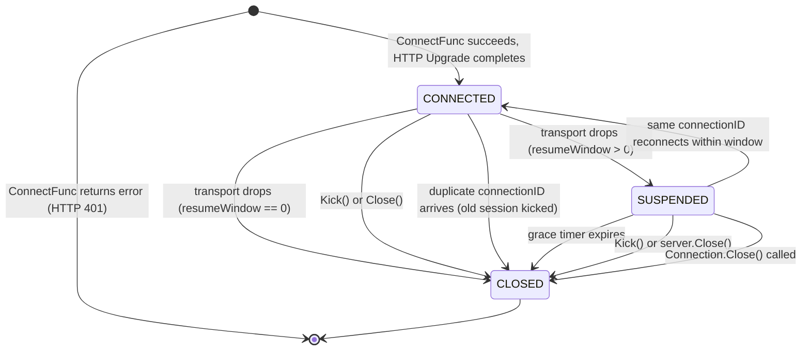

# wspulse Server Behaviour Contract

> Version: 0 (unstable — aligned with protocol v0)
> Applies to: `wspulse/server`

This document defines the **behavioural guarantees** of the wspulse server. These are promises to application-layer consumers — not implementation details. For internal architecture (goroutine model, pump design) see [`server/doc/internals.md`](https://github.com/wspulse/server/blob/main/doc/internals.md).

For API surface see [`interface.md`](./interface.md).
For wire-level details see [`protocol.md`](https://github.com/wspulse/.github/blob/main/doc/protocol.md).

---

## Session Lifecycle



States are internal — the `Connection` interface does not expose them.

---

## Hub Serialization

All session state mutations are serialized through a single-goroutine hub event loop. This guarantees:

- No concurrent map access on session/room state.
- Callback invocations for a given session are ordered (register before message, message before disconnect).
- Grace timer management (start/cancel) is race-free.

**Contract**: application code must not assume any internal timing between hub operations, but can rely on the ordering guarantees above.

---

## Callback Ordering

For a given session, callbacks fire in this order:

```
OnConnect → OnMessage* → OnDisconnect
```

| Guarantee                  | Detail                                                                                         |
| -------------------------- | ---------------------------------------------------------------------------------------------- |
| **OnConnect fires once**   | After successful registration. Runs in a separate goroutine.                                   |
| **OnMessage is serial**    | Called from the connection's read goroutine. One call completes before the next begins.         |
| **OnDisconnect fires once** | Per session lifetime, regardless of how many transport drops occur. Runs in a separate goroutine. |
| **No overlap**             | `OnDisconnect` fires only after all `OnMessage` calls for that session have completed.         |

### Resume window interaction

When `WithResumeWindow` is configured and a transport drops:

- `OnDisconnect` does **not** fire immediately. The session enters `SUSPENDED`.
- If the client reconnects within the window: `OnConnect` and `OnDisconnect` are **not** re-fired. From the application layer's perspective, the connection never dropped.
- If the grace timer expires: `OnDisconnect` fires with the original transport error.

---

## Backpressure

Each connection maintains a bounded send buffer (default 256 frames, configurable via `WithSendBufferSize`).

| Operation          | Buffer full behaviour                                                                      |
| ------------------ | ------------------------------------------------------------------------------------------ |
| `Connection.Send`  | Returns `ErrSendBufferFull`. The caller decides how to handle (retry, discard, or close).  |
| `Server.Send`      | Returns `ErrSendBufferFull`.                                                               |
| `Server.Broadcast` | **Drop-oldest**: the oldest frame in the target connection's buffer is discarded to make room. If the buffer is still full after dropping, the new frame is silently dropped. |

This ensures a slow connection cannot block the hub event loop or stall broadcasts to other healthy connections.

### Resume buffer

When a session is suspended (within the resume window), frames are buffered in an in-memory ring buffer with the same capacity as the send buffer. On reconnect, buffered frames are replayed in order before new frames are delivered.

---

## Heartbeat

The server uses RFC 6455 Ping/Pong control frames for liveness detection.

| Parameter        | Default | Valid Range        | Description                                                |
| ---------------- | ------- | ------------------ | ---------------------------------------------------------- |
| `pingPeriod`     | 10 s    | (0, 5m]            | Server sends a Ping every `pingPeriod`.                    |
| `pongWait`       | 30 s    | (pingPeriod, 10m]  | If no Pong arrives within `pongWait`, the connection dies.  |

- Clients auto-reply Pong at the WebSocket protocol layer (no application-level handling needed).
- The server also auto-replies to client-initiated Pings (gorilla default `PingHandler`).
- The constraint `pingPeriod < pongWait` must always hold.

---

## Connection Teardown

Normal and abnormal teardown follow the same cleanup path:

1. Transport read error occurs (close frame, network drop, or read deadline exceeded).
2. Hub is notified of the transport death.
3. If `resumeWindow > 0`: session enters `SUSPENDED`, grace timer starts.
4. If `resumeWindow == 0`: session is removed, `OnDisconnect` fires.
5. All internal goroutines for the session exit cleanly.

**Guarantee**: the underlying TCP connection is always closed, regardless of the teardown path. A `sync.Once` guard ensures the session's done channel is closed exactly once.

---

## Kick Semantics

`Server.Kick(connectionID)` always destroys the session immediately:

- **Bypasses the resume window** — the session is never suspended. `OnDisconnect` fires immediately.
- **Hub-serialized** — the kick request is routed through the hub event loop to prevent races with concurrent state mutations (register, transport-died, grace-expired).
- **Idempotent** — returns `ErrConnectionNotFound` if the connection has already been removed.
- After `Kick` returns `nil`, the session is guaranteed to be destroyed.

---

## Duplicate Connection ID

When a new connection registers with a `connectionID` that already exists:

1. The **old** session is kicked immediately (same as `Server.Kick`).
2. `OnDisconnect` fires for the old session with `ErrDuplicateConnectionID`.
3. The **new** session is registered normally, and `OnConnect` fires.

This applies regardless of whether the old session is `CONNECTED` or `SUSPENDED`.

---

## Graceful Shutdown

`Server.Close()`:

1. Sends WebSocket close frames to all connected clients.
2. Drains in-flight registration messages.
3. Fires `OnDisconnect` for every active session.
4. After `Close()` returns, all hub and per-connection goroutines have exited.

`Close()` is safe to call concurrently and is idempotent (guarded by `sync.Once`).

---

## Error Wrapping

Server errors follow this format:

- Sentinel errors: `errors.New("wspulse: <description>")`
- Wrapped errors: `fmt.Errorf("wspulse: <context>: %w", err)`

All server errors are prefixed with `wspulse:` for consistent identification.
