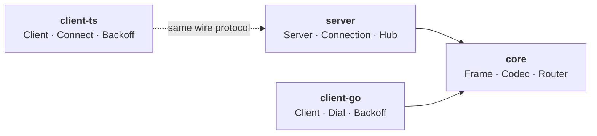

# wspulse

A modular WebSocket library ecosystem — minimal, production-ready, and easy to integrate. Go server, with first-party clients for Go and TypeScript/JavaScript.

## Architecture

| Module                                                | Language      | Description                                                                                              |
| ----------------------------------------------------- | ------------- | -------------------------------------------------------------------------------------------------------- |
| [core](https://github.com/wspulse/core)               | Go            | Shared types (`Frame`, `Codec`, sentinel errors) and Gin-style event router. Zero external dependencies. |
| [server](https://github.com/wspulse/server)           | Go            | WebSocket server: room routing, session resumption, heartbeat, backpressure.                             |
| [client-go](https://github.com/wspulse/client-go)     | Go            | Go client: auto-reconnect, exponential backoff, lifecycle callbacks.                                     |
| [client-ts](https://github.com/wspulse/client-ts)     | TypeScript/JS | TS/JS client: auto-reconnect, exponential backoff. Browser + Node.js.                                   |

## Where to Start

| I want to…                        | Go to                                                                                   |
| --------------------------------- | --------------------------------------------------------------------------------------- |
| Build a WebSocket server          | [server README](https://github.com/wspulse/server#readme)                               |
| Connect from Go                   | [client-go README](https://github.com/wspulse/client-go#readme)                         |
| Connect from TypeScript/JS        | [client-ts README](https://github.com/wspulse/client-ts#readme)                         |
| Route frames by event name        | [core/router](https://github.com/wspulse/core#router)                                   |
| Understand the wire protocol      | [server/doc/protocol.md](https://github.com/wspulse/server/blob/main/doc/protocol.md)   |
| Understand server internals       | [server/doc/internals.md](https://github.com/wspulse/server/blob/main/doc/internals.md) |
| Contribute                        | [CONTRIBUTING.md](../CONTRIBUTING.md)                                                   |

## Key Features

- **Room-based routing** — connections are partitioned into rooms; broadcast targets a single room
- **Session resumption** — configurable grace window; transparent WebSocket swap on reconnect
- **Event router** — Gin-style middleware chain for dispatching frames by event name (`core/router`)
- **Pluggable codecs** — JSON by default; swap in Protobuf, MessagePack, or any custom encoding
- **Auto-reconnect** — client-side exponential backoff with configurable retries
- **Any HTTP router** — standard `http.Handler`; works with net/http, Gin, Chi, Echo, etc.
- **Cross-platform TS/JS client** — single package for Node.js (`ws`) and browsers (native `WebSocket`)

## Roadmap

First-party client libraries are planned for Kotlin, Swift, and Python — all implementing the same [wire protocol](https://github.com/wspulse/server/blob/main/doc/protocol.md) and [behaviour contract](doc/contracts/client-behaviour.md).

## Status

| Module      | Version   |
| ----------- | --------- |
| `server`    | **v0.3.0** |
| `core`      | **v0.2.0** |
| `client-go` | **v0.2.1** |
| `client-ts` | **v0.1.0** |

APIs are being stabilized. Breaking changes may occur before v1.

## License

All modules are released under the [MIT License](https://github.com/wspulse/core/blob/main/LICENSE).
