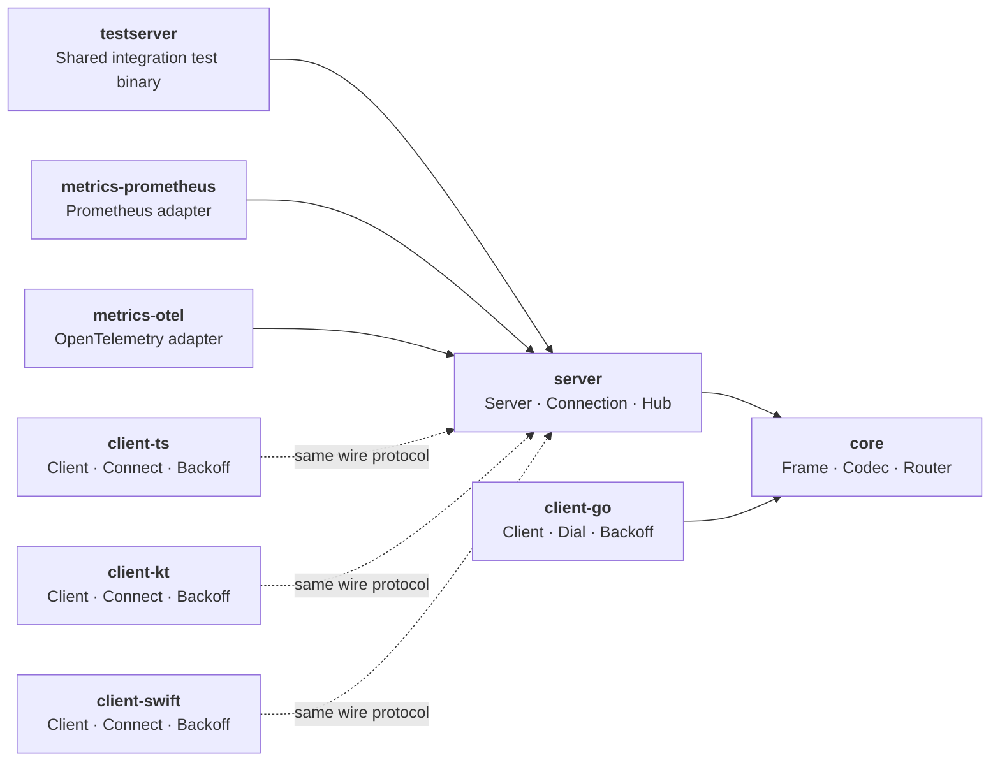

# wspulse

A modular WebSocket library ecosystem -- minimal, production-ready, and easy to integrate. Go server, with first-party clients for Go, TypeScript, Kotlin/Android, and Swift/Apple.

## Architecture

## Modules

| Module | Language | Description |
| --- | --- | --- |
| [core](https://github.com/wspulse/core) | Go | Shared types (`Frame`, `Codec`, sentinel errors) and Gin-style event router. Zero external dependencies. |
| [server](https://github.com/wspulse/server) | Go | WebSocket server: room routing, session resumption, heartbeat, backpressure, metrics interface. |
| [client-go](https://github.com/wspulse/client-go) | Go | Go client: auto-reconnect, exponential backoff, lifecycle callbacks. |
| [client-ts](https://github.com/wspulse/client-ts) | TypeScript | TypeScript client: auto-reconnect, exponential backoff. Browser + Node.js. |
| [client-kt](https://github.com/wspulse/client-kt) | Kotlin | Kotlin/JVM + Android client: auto-reconnect, exponential backoff. Ktor CIO + coroutines. |
| [client-swift](https://github.com/wspulse/client-swift) | Swift | Swift client: auto-reconnect, exponential backoff. Actor-based concurrency. iOS 16+ / macOS 13+. |
| [testserver](https://github.com/wspulse/testserver) | Go | Shared integration test server for non-Go clients. Dual HTTP + WebSocket ports. |
| [metrics-prometheus](https://github.com/wspulse/metrics-prometheus) | Go | Prometheus adapter for server's `MetricsCollector` interface. |
| [metrics-otel](https://github.com/wspulse/metrics-otel) | Go | OpenTelemetry adapter for server's `MetricsCollector` interface. |
| [docs](https://github.com/wspulse/docs) | Markdown | User-facing documentation: guides, reference, examples. |

## Where to Start

| I want to... | Go to |
| --- | --- |
| Build a WebSocket server | [server README](https://github.com/wspulse/server#readme) |
| Connect from Go | [client-go README](https://github.com/wspulse/client-go#readme) |
| Connect from TypeScript | [client-ts README](https://github.com/wspulse/client-ts#readme) |
| Connect from Kotlin/Android | [client-kt README](https://github.com/wspulse/client-kt#readme) |
| Connect from Swift/Apple | [client-swift README](https://github.com/wspulse/client-swift#readme) |
| Route frames by event name | [core/router](https://github.com/wspulse/core#router) |
| Add Prometheus metrics | [metrics-prometheus README](https://github.com/wspulse/metrics-prometheus#readme) |
| Add OpenTelemetry metrics | [metrics-otel README](https://github.com/wspulse/metrics-otel#readme) |
| Understand the wire protocol | [doc/protocol.md](https://github.com/wspulse/.github/blob/main/doc/protocol.md) |
| Understand server internals | [server/doc/internals.md](https://github.com/wspulse/server/blob/main/doc/internals.md) |
| Contribute | [CONTRIBUTING.md](../CONTRIBUTING.md) |

## Key Features

- **Room-based routing** -- connections are partitioned into rooms; broadcast targets a single room
- **Session resumption** -- configurable grace window; transparent WebSocket swap on reconnect with frame replay
- **Event router** -- Gin-style middleware chain for dispatching frames by event name (`core/router`)
- **Pluggable codecs** -- JSON by default; swap in Protobuf, MessagePack, or any custom encoding
- **Auto-reconnect** -- client-side exponential backoff with equal jitter and configurable retries
- **Dual heartbeat** -- both server and client independently send Ping/Pong for bidirectional liveness detection
- **Observable** -- pluggable `MetricsCollector` interface with Prometheus and OpenTelemetry adapters (16 instruments)
- **Any HTTP router** -- standard `http.Handler`; works with net/http, Gin, Chi, Echo, etc.
- **Cross-platform TypeScript client** -- single package for Node.js (`ws`) and browsers (native `WebSocket`)

## Status

| Module | Latest |
| --- | --- |
| core | **v0.2.0** |
| server | **v0.6.0** |
| client-go | **v0.4.1** |
| client-ts | **v0.4.0** |
| client-kt | **v0.4.0** |
| client-swift | **v0.3.0** |
| testserver | **v0.2.0** |
| metrics-prometheus | **v0.2.0** |
| metrics-otel | **v0.2.0** |

APIs are being stabilized. Breaking changes may occur before v1.

## Roadmap

All modules implement the same [wire protocol](https://github.com/wspulse/.github/blob/main/doc/protocol.md) and [behaviour contracts](doc/contracts/). See the [branching strategy](doc/branching-strategy.md) for the release workflow.

## License

All modules are released under the [MIT License](https://github.com/wspulse/core/blob/main/LICENSE).
